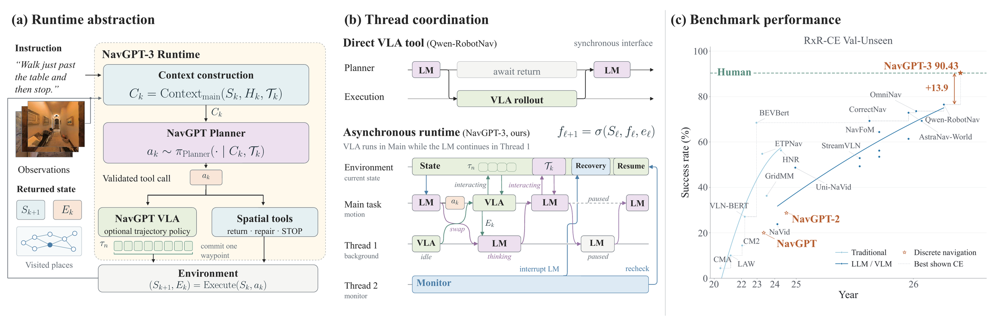
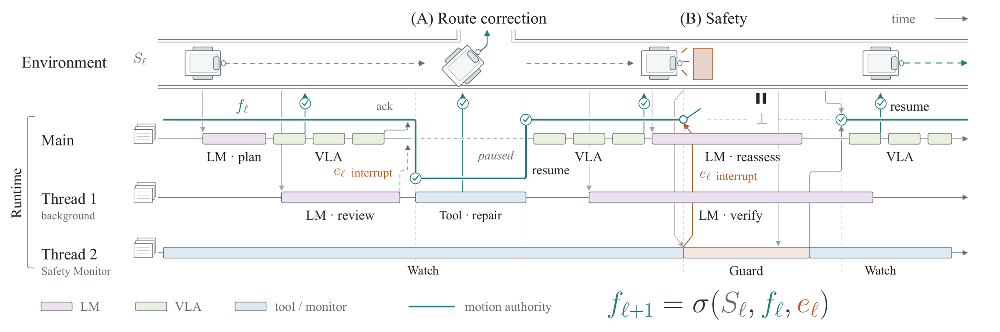
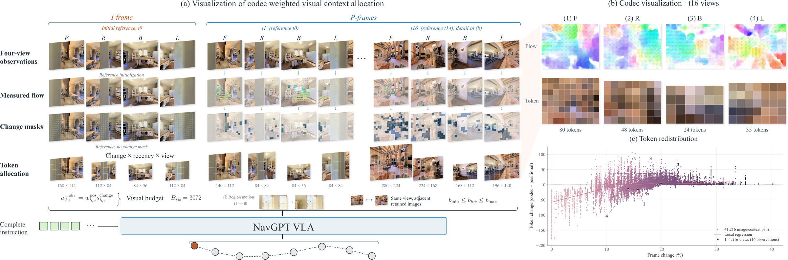

<div align="center">

<h1>NavGPT-3: Harnessing Context in a Hierarchical Navigation Runtime</h1>

<div>
    <a href='https://gengzezhou.github.io' target='_blank'>Gengze Zhou<sup>1,2</sup></a>;
    <a href='https://yiconghong.github.io' target='_blank'>Yicong Hong<sup>4</sup></a>;
    <a href='https://jzhzhang.github.io' target='_blank'>Jiazhao Zhang<sup>5</sup></a>;
    <a href='https://scholar.google.com/citations?user=nMSCtlEAAAAJ' target='_blank'>Xunyi Zhao<sup>1</sup></a>;
    <a href='https://jianzhou0420.github.io' target='_blank'>Jian Zhou<sup>1</sup></a>;
    <a href='https://chezacar.github.io' target='_blank'>Zixing Lei<sup>6</sup></a>;
    <a href='https://zunwang1.github.io' target='_blank'>Zun Wang<sup>7</sup></a>;
    <a href='https://github.com/zhaoc5' target='_blank'>Chongyang Zhao<sup>8</sup></a>;
    <a href='https://xionghuichen.github.io' target='_blank'>Xionghui Chen<sup>5</sup></a>;
    <a href='https://users.cecs.anu.edu.au/~sgould/' target='_blank'>Stephen Gould<sup>2,3</sup></a>;
    <a href='https://researchers.adelaide.edu.au/profile/anton.vandenhengel' target='_blank'>Anton van den Hengel<sup>1,2</sup></a>;
    <a href='https://researchers.adelaide.edu.au/profile/qi.wu01' target='_blank'>Qi Wu<sup>1,2</sup></a>
</div>
<sup>1</sup>AIML, Adelaide University
<sup>2</sup>Metacognition
<sup>3</sup>ANU
<sup>4</sup>Roblox
<sup>5</sup>PKU
<sup>6</sup>SJTU
<sup>7</sup>UNC Chapel Hill
<sup>8</sup>UNSW

<br>

<div>
    <a href='https://github.com/metacognitionai/NavGPT-3' target='_blank'></a>
    <a href='https://metacognitionai.github.io/NavGPT3/' target='_blank'></a>
    
    <a href='https://huggingface.co/Metacognition-AI' target='_blank'></a>
    <a href="https://opensource.org/licenses/Apache-2.0"></a>
    <a href="https://github.com/metacognitionai/zeos"></a>
    <a href="https://code.claude.com/docs/en/agent-sdk/overview"></a>
    <a href="https://developers.openai.com/codex"></a>
    <a href="https://github.com/facebookresearch/habitat-sim"></a>
</div>

</div>


## Abstract
Language models trained with long-horizon agentic reinforcement learning can generalize knowledge through reasoning, express precise actions, and pursue goals over many steps, raising the ceiling on what an embodied agent can understand and decide. Physical interaction, however, remains the domain of action policies, which provide dense, low-latency control. We present NavGPT-3, a harness that connects the two models, with an OS-like runtime built above it: reasoning, acting, and monitoring run as threads with their own context, tools, and permissions, while the runtime schedules them and decides which thread controls the robot's motion, so that the robot can react to sudden real-world events through interruption and thread switching. Beneath it, our action policy NavGPT VLA, trained on 19.28M examples, allocates visual tokens using codec allocation, in proportion to scene change; its 8B model alone reaches 74.51 SR on R2R-CE and leads RxR-CE with 78.19 SR. With the complete harness, NavGPT-3 sets the state of the art on R2R-CE (81.51 SR) and, for the first time, brings an autonomous agent to human level: on RxR-CE it matches human followers in success (90.43 vs. 90.4 SR) and path fidelity (78.47 vs. 77.7 nDTW) at 1 min 22 s per episode, versus roughly 3 min for a human. We comprehensively ablate the harness design and the interaction between the two models, showing how tools and the action policy shape the path from language-model reasoning to physical control: when NavGPT VLA executes the route, the reasoning loop shortens and the system's minimum reaction time falls from 3–19 s per language-model decision to 0.5–1 s per action-policy step (1–2 Hz). These results show that designing this embodied interface is central to connecting frontier language-model intelligence with low-level physical control.

## Method


Figure 1. Overview of NavGPT-3: (a) runtime abstraction with the planner, VLA, and spatial tools; (b) synchronous tool use versus asynchronous thread coordination; and (c) benchmark performance. **NavGPT-3 reaches human performance on RxR-CE**.



Figure 2. Illustrative foreground-control patterns in the NavGPT-3 Runtime. Thin bars mark concurrent activity; the teal path denotes motion authority. (A) A route-review interrupt pauses main execution for correction, followed by resumption. (B) A safety interrupt revokes authority while inference continues; resumption requires fresh state and runtime authorization.



Figure 3. **Codec-weighted visual-context allocation.** (a) Change, recency, and view jointly determine whole-image resolution for a four-view history, with an initial I-frame and subsequent P-frames. (b) Optical-flow diagnostics and resulting token grids for the four views at $t_{16}$. (c) Allocation change relative to positional weighting versus RGB change $100\delta_{h,v}$ for 41,216 replayed image/context pairs from 13 recorded histories at $B_{\mathrm{vis}}=3072$. Curve: local regression; numbers match (b).

## TODOs

> NavGPT-3 consists of three layers:
>
> 1. Interaction layer: NavGPT VLA.
> 2. Harness layer, built on top of the VLA.
> 3. Deployment runtime layer.
>
> This repository releases the VLA inference code, the harness, and the evaluation code for simulation.
> The runtime is built on [ZEOS](https://github.com/metacognitionai/zeos). We will later release the ZEOS-based deployment code on Unitree, including thread management, in a separate repository.

- [x] Release NavGPT VLA inference code: the NavGPT3 model, processors, and inference service.
- [x] Release the NavGPT-3 harness, with Claude Agent SDK and Codex SDK Planner runtimes.
- [x] Release the R2R-CE and RxR-CE simulation evaluation code.
- [x] Release configs for the main results and ablations.
- [x] Upload NavGPT3-4B and NavGPT3-8B weights to Hugging Face.
- [ ] Release the ZEOS-based deployment code on Unitree.

## Prerequisites

### Installation

Choose **uv** or **conda** for the Planner and the VLA. Both workflows use the same paths and commands, with a separate environment for each of the three components:

| Component | Environment | Python | Dependencies |
|---|---|---|---|
| Planner and `navgpt` command | `.envs/planner` | 3.11 | `pyproject.toml` |
| NavGPT VLA service | `.envs/vla` | 3.11 | PyTorch 2.6, `requirements-vla.txt` |
| Habitat Environment service | `.envs/habitat` | 3.8 | Habitat-Sim 0.1.7, NumPy, `numpy-quaternion`, Pillow, PyYAML |

Use a Linux machine with NVIDIA GPUs for rendering and VLA inference; the Planner itself needs no GPU. Run every command from the repository root, and install either [uv](https://docs.astral.sh/uv/getting-started/installation/) or [conda](https://docs.conda.io/projects/conda/en/stable/user-guide/install/index.html) first.

#### Option A: uv

```bash
uv venv --python 3.11 .envs/planner
uv pip install --python .envs/planner/bin/python --editable .

uv venv --python 3.11 .envs/vla
uv pip install --python .envs/vla/bin/python torch==2.6.0 torchvision==0.21.0 \
  --index-url https://download.pytorch.org/whl/cu124
uv pip install --python .envs/vla/bin/python -r requirements-vla.txt
uv pip install --python .envs/vla/bin/python --no-deps --editable .
```

#### Option B: conda

```bash
conda create --yes --prefix "$PWD/.envs/planner" \
  --override-channels -c conda-forge python=3.11 pip
conda run --no-capture-output --prefix "$PWD/.envs/planner" \
  python -m pip install --editable .

conda create --yes --prefix "$PWD/.envs/vla" \
  --override-channels -c conda-forge python=3.11 pip
conda run --no-capture-output --prefix "$PWD/.envs/vla" \
  python -m pip install torch==2.6.0 torchvision==0.21.0 \
  --index-url https://download.pytorch.org/whl/cu124
conda run --no-capture-output --prefix "$PWD/.envs/vla" \
  python -m pip install -r requirements-vla.txt
conda run --no-capture-output --prefix "$PWD/.envs/vla" \
  python -m pip install --no-deps --editable .
```

The examples use the CUDA 12.4 wheels; choose another **PyTorch 2.6** build from the [PyTorch version guide](https://pytorch.org/get-started/previous-versions/#v260) if your machine needs it. Keep `transformers==5.18.0` from `requirements-vla.txt`, because the NavGPT3 model subclasses its Qwen3-VL classes.

#### Habitat Environment

For either workflow, install the simulator in its own conda prefix:

```bash
conda create --yes --prefix "$PWD/.envs/habitat" \
  --override-channels -c aihabitat -c conda-forge \
  python=3.8 habitat-sim=0.1.7 headless 'numpy<2' quaternion pillow pyyaml
```

The Environment uses Habitat-Sim directly, without Habitat-Lab, and needs a working EGL/OpenGL device for rendering. See the [VLN-CE setup](https://github.com/jacobkrantz/VLN-CE#setup) if no prebuilt Habitat-Sim package fits your machine.

### Data Preparation

R2R-CE and RxR-CE share the Matterport3D scenes but need separate episode archives and dense ground-truth paths:

| Download | What to obtain | Setup |
|---|---|---|
| [Matterport3D](https://niessner.github.io/Matterport/#download) | Habitat scene archive: matching `.glb` and `.navmesh` files | Request access, accept the provider's terms, then run the supplied downloader with `--task habitat` |
| [R2R-CE v1-3 preprocessed](https://drive.google.com/file/d/1fo8F4NKgZDH-bPSdVU3cONAkt5EW-tyr/view) | `R2R_VLNCE_v1-3_preprocessed.zip`, including dense ground truth | Extract once; `val_unseen` contains 1,839 episodes |
| [RxR-CE v0](https://drive.google.com/file/d/145xzLjxBaNTbVgBfQ8e9EsBAV8W-SM0t/view) | `RxR_VLNCE_v0.zip`, including guide and follower episodes and ground truth | Extract once; English guide instructions are selected by default |
| [OpenNav R2R-CE 100](https://github.com/YanyuanQiao/Open-Nav) | The 100-episode R2R-CE subset released with Open-Nav, used by the ablations | Download it from the Open-Nav repository and set the episode file as `episodes.opennav100` in `configs/paths.yaml` |

No BERT features, GloVe embeddings, audio, or training data are needed. The data is structured as follows:

```
scene-datasets/mp3d/<scan>/
├── <scan>.glb
└── <scan>.navmesh
R2R_VLNCE_v1-3_preprocessed/val_unseen/
├── val_unseen.json.gz
└── val_unseen_gt.json.gz
RxR_VLNCE_v0/val_unseen/
├── val_unseen_guide.json.gz
└── val_unseen_guide_gt.json.gz
```

Write these locations into `configs/paths.yaml` (see the [Configuration Guide](#configuration-guide)), then check each dataset. The check needs no simulator:

```bash
.envs/planner/bin/navgpt check-data --config configs/experiments/vln/navgpt3_astra_r2r.yaml
.envs/planner/bin/navgpt check-data --config configs/experiments/vln/navgpt3_astra_rxr.yaml
```

It requires valid annotations, dense ground truth for every episode, and every referenced mesh and navmesh, and it reports the episode count and a dataset fingerprint. The [download guide](docs/DATASETS.md) covers access, extraction, and the expected files in detail.

### Model Weights

| Model | Hugging Face | Download size |
|---|---|---|
| NavGPT3-4B | [Metacognition-AI/NavGPT3-4B](https://huggingface.co/Metacognition-AI/NavGPT3-4B) | 9.7 GB |
| NavGPT3-8B | [Metacognition-AI/NavGPT3-8B](https://huggingface.co/Metacognition-AI/NavGPT3-8B) | 17.6 GB |

Install the Hugging Face CLI separately from the pinned VLA environment, then download each complete repository so the shards, tokenizer, and processor files stay together:

```bash
uv tool install huggingface_hub     # or: pip install -U huggingface_hub
hf download Metacognition-AI/NavGPT3-8B --local-dir /path/to/NavGPT3-8B
hf download Metacognition-AI/NavGPT3-4B --local-dir /path/to/NavGPT3-4B
```

To pin an experiment to a fixed upload, add `--revision` with the repository's commit hash and record it with the results. Then point `configs/paths.yaml` at the downloaded directories; experiments select one with `vla.checkpoint`:

```yaml
checkpoints:
  navgpt3-4b: /path/to/NavGPT3-4B
  navgpt3-8b: /path/to/NavGPT3-8B
```

Check a bundle without loading the weights:

```bash
.envs/planner/bin/navgpt check-checkpoint --config configs/experiments/vln/vla_8b_r2r.yaml
```

The checkpoints load directly with this repository's NavGPT3 code, either through the VLA service or in Python:

```python
from navgpt.vla.runtime import load_from_pretrained

model, processor = load_from_pretrained("/path/to/NavGPT3-8B", device="cuda")
```

The [checkpoint guide](docs/HUGGING_FACE.md) lists the files in a bundle and covers loading in more detail.

#### Model Code and Tensor Names

The architecture lives in [`navgpt/vla/runtime/models/`](navgpt/vla/runtime/models/). NavGPT3 is the Transformers Qwen3-VL model with an MLP action head; both model sizes share this implementation, and their checkpoint configurations select the dimensions.

| Source | What it implements |
|---|---|
| [`modeling_navgpt3.py`](navgpt/vla/runtime/models/modeling_navgpt3.py) | `NavGPT3ForConditionalGeneration`: Qwen3-VL plus the action head, and the vision position-embedding arithmetic the checkpoints were trained with |
| [`configuration_navgpt3.py`](navgpt/vla/runtime/models/configuration_navgpt3.py) | `NavGPT3Config`: Qwen3-VL configuration plus action-head sizes |
| [`image_processing_navgpt3.py`](navgpt/vla/runtime/models/image_processing_navgpt3.py) | Per-image visual-token budgets (temporal, camera, and codec weights) on the Qwen2-VL image processor |
| [`processing_navgpt3.py`](navgpt/vla/runtime/models/processing_navgpt3.py) | Multimodal processor that passes the token budgets through |
| [`runtime/inference.py`](navgpt/vla/runtime/inference.py) / [`agent.py`](navgpt/vla/agent.py) | Strict loading, prompt format, multi-view history, frame cache, and navigation inference |

The model class is `NavGPT3ForConditionalGeneration`, with `model_type: "navgpt3"` in `config.json`. Tensor names follow the Transformers Qwen3-VL layout, plus the action head:

```text
model.visual.blocks.0.attn.proj.weight
model.language_model.layers.0.self_attn.q_proj.weight
lm_head.weight
action_head.0.weight
```

### Planner Sign-in

The Planner runs under your own account, with a subscription or an API key. The GPT-6 Astra configs use the Codex runtime and the Claude Opus 5 configs use the Claude runtime. VLA-only experiments make no Planner calls and need no sign-in.

| Runtime | Subscription | API |
|---|---|---|
| Codex | ChatGPT plan, through `codex login` | OpenAI API key, through `codex login --with-api-key` |
| Claude | Claude Pro or Max, through `/login` in the Claude CLI | `ANTHROPIC_API_KEY`, a cloud provider, or a gateway |

Both CLIs ship in the Planner environment:

```bash
CODEX=$(.envs/planner/bin/python -c "import codex_cli_bin; print(codex_cli_bin.bundled_codex_path())")
CLAUDE=$(.envs/planner/bin/python -c "import claude_agent_sdk, pathlib; print(pathlib.Path(claude_agent_sdk.__file__).parent / '_bundled' / 'claude')")
```

**1. Sign in with a subscription.** The sign-ins are stored under `~/.codex/` and `~/.claude/`, and every run on the machine uses them. A separately installed `codex` or `claude` shares the same sign-in.

```bash
$CODEX login          # choose "Sign in with ChatGPT" in the browser that opens
$CODEX login status
$CLAUDE               # type /login, choose your Claude subscription, then /exit
```

On a remote or headless machine, such as a GPU server:

```bash
$CODEX login --device-auth          # then enter the printed code in any browser

claude setup-token                  # on a machine with a browser
export CLAUDE_CODE_OAUTH_TOKEN=...  # on the server
```

**2. Or use the API**, billed per token:

```bash
printenv OPENAI_API_KEY | $CODEX login --with-api-key
export ANTHROPIC_API_KEY=sk-ant-...
```

The Claude runtime also accepts Amazon Bedrock, Google Vertex AI, and Microsoft Foundry through the usual variables, such as `CLAUDE_CODE_USE_BEDROCK=1` with your AWS credentials; set `planner.model` to that provider's model ID. A compatible gateway works through `ANTHROPIC_BASE_URL` with `ANTHROPIC_AUTH_TOKEN`. An API key in the environment takes precedence over the Claude subscription, so unset `ANTHROPIC_API_KEY` and `ANTHROPIC_AUTH_TOKEN` to run on the subscription. For Codex, the most recent `codex login` decides.

**3. Run.** `navgpt run` and `navgpt launch` check the sign-in and the model before the first episode: Codex reads the account's model list; Claude makes one 4-token API call with an API key, or sends one short request through the CLI with a subscription. `navgpt preflight --config CFG` runs the same checks without starting episodes, once the services are up.

When a subscription's usage window is spent, the Planner waits and retries the episode every 15 minutes, for up to 6 hours, instead of scoring it. Short throttles back off from 30 s, doubling to at most 5 min, and an episode is excluded after 6 throttled attempts. Sharded runs share one account, so eight shards spend its allowance eight times as fast. `planner.max_budget_usd` caps each Claude episode at the SDK's cost estimate, with a subscription too; set it to `null` to rely on the turn and time limits. Codex reports no cost and requires `null`.

## Key Features

### Context and Spatial Tools

The harness gives the Planner eight tools: forward, panoramic, and map observation; instruction delegation to NavGPT VLA; relative repair moves; return to a visited node; node annotation; and explicit episode termination. Observations carry direction, bearing, and clearance labels; the observed map shows only what the robot has seen. Registration is the capability boundary: an experiment's tool list decides exactly which tools the Planner can call.

### Planner-Guided Execution

The Planner chooses a task or subtask instruction, NavGPT VLA predicts local waypoints, and the harness returns route keyframes, endpoint views, and persistent spatial references. A VLA stop ends only the delegated operation; the Planner decides whether to continue, repair, revisit, or finish. The Planner runs on the Claude Agent SDK or the Codex SDK, through the same tool server and briefings.

### Adaptive Visual Context

NavGPT VLA keeps a temporal multi-view history and shares a bounded visual-token budget across it with codec allocation (Figure 3). The VLA always receives the unannotated camera views; the labelled views go only to the Planner.

### Multi-GPU Evaluation

`navgpt launch` starts the services on every GPU in a config, runs one shard of the episodes on each, and merges the shards into a result scored like a single run. Episode traces, observed frames, and a result viewer make every run inspectable.

## Configuration Guide

Machine paths go in one file:

```bash
cp configs/paths.example.yaml configs/paths.yaml   # then fill in the paths
```

It holds the dataset roots (`data.r2r`, `data.rxr`, `data.scenes`), curated episode files under `episodes`, checkpoint directories under `checkpoints`, and optionally `codex_bin` and the service interpreters under `python`.

Everything else is an experiment config under [`configs/experiments/`](configs/experiments/). Each file is self-contained: it lists the GPUs and every setting for the Environment, the VLA, the Planner, and the harness, in the same order and with short comments, so one file describes the whole run. Every Planner experiment exists for both GPT-6 Astra and Claude Opus 5, at high reasoning effort:

| Directory | Experiments |
|---|---|
| `vln/` | NavGPT3-4B and -8B alone, and NavGPT-3 with each Planner, on full R2R-CE and RxR-CE `val_unseen` |
| `tools/<planner>/` | Which tools the Planner gets, from primitive moves to all eight tools, on the R2R-CE subset; `tools/vla_only.yaml` is the VLA alone |
| `representation/<planner>/` | Five ways of drawing labels, bearings, and the map |
| `review/<planner>/` | How often the Planner reviews a VLA rollout: never, every 32 or 16 steps, or every step |

For example, `configs/experiments/tools/astra/vla.yaml` contains:

```yaml
# GPT-6 Astra with the VLA, camera views and stopping, on the R2R subset.

gpus: [0, 1, 2, 3, 4, 5, 6, 7]     # one shard per GPU (navgpt launch)

dataset:
  name: r2r
  split: opennav100
  episodes: all
  episodes_file: opennav100        # key under `episodes` in configs/paths.yaml
  ground_truth_split: val_unseen   # dense ground truth for nDTW

environment:
  url: http://127.0.0.1:9200
  max_steps: 500
  forward_view_px: 512
  panorama_view_px: 512            # sharper views for the Planner
  turn_angle_deg: 15
  step_size_m: 0.25
  allow_sliding: true

vla:
  url: http://127.0.0.1:8000
  checkpoint: navgpt3-8b           # key under `checkpoints` in configs/paths.yaml
  visual_token_budget: 3072
  frame_cache: precompute
  seed: 20260910                   # per-episode VLA seed base (study displays)

planner:
  runtime: codex                   # codex (GPT models) or claude (Claude models)
  model: gpt-6-astra
  effort: high                     # reasoning effort
  max_turns: 200                   # Planner responses per episode
  episode_timeout_s: 2400
  max_budget_usd: null             # Codex reports no cost
  tools:
    - navigate_by_instruction
    - observe_forward
    - observe_panorama
    - terminate_episode

harness:
  interface: reference
  review_every: 0                  # VLA steps between Planner reviews; 0: only when the VLA stops
  route_finding: true              # navigate_relative follows the walkable route
  vla_steps_per_call: 200          # step cap on one navigate_by_instruction call

output:
  dir: outputs
  save_frames: true
```

To run a variant, copy a config and edit it. Unknown keys and invalid values are rejected with the list of valid ones. The [usage reference](docs/USAGE.md#experiment-configs) describes every key.

## Evaluation

### Reproduce the Main Results

Each result has a config under [`configs/experiments/vln/`](configs/experiments/vln/), with the R2R-CE and RxR-CE variants side by side:

<table border="1" width="100%">
    <tr align="center">
        <th>Method</th><th>Config</th><th colspan="4">R2R-CE Val-Unseen</th><th colspan="4">RxR-CE Val-Unseen</th>
    </tr>
    <tr align="center">
        <td></td><td></td><td>NE↓</td><td>OSR↑</td><td>SR↑</td><td>SPL↑</td><td>NE↓</td><td>nDTW↑</td><td>SR↑</td><td>SPL↑</td>
    </tr>
    <tr align="center">
        <td>NavGPT VLA 4B</td><td><code>vla_4b_{r2r,rxr}</code></td><td>3.41</td><td>79.91</td><td>72.54</td><td>67.19</td><td>3.35</td><td>73.33</td><td>76.77</td><td>67.77</td>
    </tr>
    <tr align="center">
        <td>NavGPT VLA 8B</td><td><code>vla_8b_{r2r,rxr}</code></td><td>3.29</td><td>80.19</td><td>74.51</td><td>68.54</td><td>3.05</td><td>74.85</td><td>78.19</td><td>68.98</td>
    </tr>
    <tr align="center">
        <td>NavGPT-3 (Claude Opus 5)</td><td><code>navgpt3_opus_{r2r,rxr}</code></td><td>2.77</td><td>84.07</td><td>79.01</td><td>70.16</td><td>2.27</td><td>75.09</td><td>84.80</td><td>69.85</td>
    </tr>
    <tr align="center">
        <td>NavGPT-3 (GPT-6 Astra)</td><td><code>navgpt3_astra_{r2r,rxr}</code></td><td>2.18</td><td>86.99</td><td>81.51</td><td>70.42</td><td>1.56</td><td>78.47</td><td>90.43</td><td>74.31</td>
    </tr>
</table>

Both NavGPT-3 systems use the 8B VLA. One command runs an experiment on the GPUs listed in its config:

```bash
CFG=configs/experiments/vln/navgpt3_astra_r2r.yaml
.envs/planner/bin/navgpt launch --config $CFG
```

`navgpt run` and `navgpt launch` check the services, the registered tools, and the model before the first episode. Running the same command again keeps the scored episodes and runs the rest; `--episodes 0-9` runs a quick check on the first ten. Experiments without a `planner` section run the VLA alone.

### Multi-GPU Runs

`navgpt launch` starts an Environment service on every GPU in `gpus`, plus a VLA service when the experiment uses the VLA. Once they are ready, it runs one shard of the episodes on each GPU and merges the shards into `outputs/<experiment>/`. Shard *i* runs every *N*-th episode from *i*, so each shard mixes scenes, and the merged result is scored like a single run. The shipped configs list eight GPUs; `--gpus` overrides that for another machine:

```bash
.envs/planner/bin/navgpt launch --config $CFG --gpus 0         # one GPU
.envs/planner/bin/navgpt launch --config $CFG --gpus 0-3       # four GPUs
.envs/planner/bin/navgpt launch --config $CFG --gpus 0,0,1,1   # two shards per GPU
```

Each VLA service loads the whole NavGPT3 model on its own GPU; the model is never split across GPUs. So every listed GPU must hold the checkpoint and Habitat rendering, twice over if it is listed twice. Shard *i* uses the ports of `environment.url` and `vla.url` plus *i*. Services are stopped when the run ends, unless `--keep-services` is given; a later launch reuses a running service only if it serves the same settings. Logs go to `outputs/.launch/<experiment>/`. The services use the interpreters from [Installation](#installation); set `python` in `configs/paths.yaml` if yours are elsewhere.

### Running the Services Yourself

To run the pieces yourself, for example with the services on another machine, start them from the same config, each in its own environment:

```bash
.envs/habitat/bin/python -m navgpt.environment --config $CFG --gpu 0
.envs/vla/bin/python -m navgpt.vla --config $CFG --gpu 0
.envs/planner/bin/navgpt run --config $CFG
```

The [usage reference](docs/USAGE.md#multi-gpu-runs) shows the same layout sharded by hand across several GPUs.

### Outputs and Metrics

Results are written to `outputs/<experiment>/`:

```text
summary.json        per-episode records and the aggregate over scored episodes
episode_<i>.jsonl   event stream: tool calls, results, and metrics
live/ep<i>/         observed frames and action log (Planner experiments)
```

Metrics are SR, SPL, OSR, navigation error, trajectory length, nDTW, and SDTW. Success requires a geodesic distance of at most 3 m to the goal, SPL is normalised by the start-to-goal geodesic distance, and SDTW is success-weighted nDTW. Browse runs with `.envs/planner/bin/navgpt view` and open http://127.0.0.1:8080.

This harness uses NavGPT panoramic waypoints, whose sensors and motion differ from the official RxR-Habitat challenge, so results are local validation numbers rather than leaderboard submissions. `--blind` on the Environment replaces rendering with synthetic pixels for plumbing checks only.

### Ablations

The ablations run on the OpenNav R2R-CE 100-episode subset, with a config for each Planner:

| Configs | Ablation |
|---|---|
| `configs/experiments/tools/<planner>/` | Which tools the Planner gets, from primitive moves to all eight tools; `tools/vla_only.yaml` is the VLA alone |
| `configs/experiments/representation/<planner>/` | How labels, bearings, and the map are drawn |
| `configs/experiments/review/<planner>/` | How often the Planner reviews a VLA rollout |

They run with the same `navgpt launch` command. The [usage reference](docs/USAGE.md#controlled-studies) describes the study displays and review scheduling.

## Acknowledgements
We extend our gratitude to Matterport3D for their valuable contributions to the open-source platform and community.

We also acknowledge the significant benefits of using [Habitat](https://github.com/facebookresearch/habitat-sim), [VLN-CE](https://github.com/jacobkrantz/VLN-CE), and [Qwen3-VL](https://github.com/QwenLM/Qwen3-VL) in this work. Our thanks go out to the creators of these outstanding projects. The Planner builds on AgentCanvas's evaluation and MCP patterns, and the VLA service includes work derived from VLNCE-EVAL; existing upstream source notices are retained.

The source code is released under the [Apache 2.0 license](LICENSE), subject to the component licenses and attribution in [NOTICE](NOTICE), including the [VLA service's MIT license](navgpt/vla/LICENSE). Model weights and datasets have separate licensing terms; the source license does not grant rights to them.

## Citation

If you find this work helpful, please consider citing:

```bibtex
@article{zhou2026navgpt3,
  title={NavGPT-3: Harnessing Context in a Hierarchical Navigation Runtime},
  author={Zhou, Gengze and Hong, Yicong and Zhang, Jiazhao and Zhao, Xunyi and Zhou, Jian and Lei, Zixing and Wang, Zun and Zhao, Chongyang and Chen, Xionghui and Gould, Stephen and van den Hengel, Anton and Wu, Qi},
  year={2026}
}

@inproceedings{zhou2024navgpt,
  title={NavGPT: Explicit Reasoning in Vision-and-Language Navigation with Large Language Models},
  author={Zhou, Gengze and Hong, Yicong and Wu, Qi},
  booktitle={Proceedings of the AAAI Conference on Artificial Intelligence},
  volume={38},
  pages={7641--7649},
  year={2024}
}

@inproceedings{zhou2024navgpt2,
  title={NavGPT-2: Unleashing Navigational Reasoning Capability for Large Vision-Language Models},
  author={Zhou, Gengze and Hong, Yicong and Wang, Zun and Wang, Xin Eric and Wu, Qi},
  booktitle={European Conference on Computer Vision (ECCV)},
  pages={260--278},
  year={2024}
}
```
